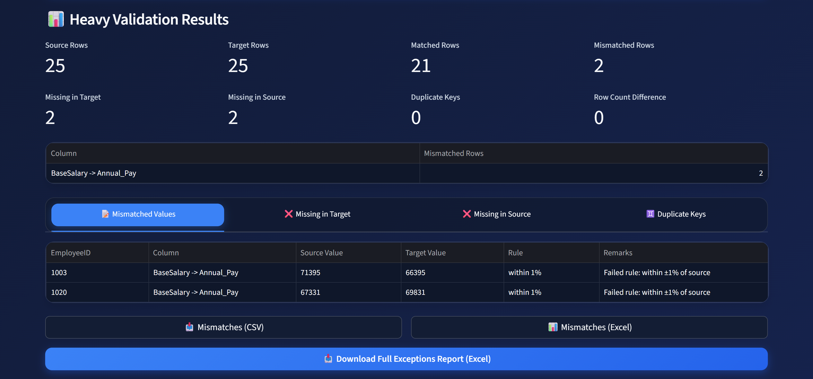
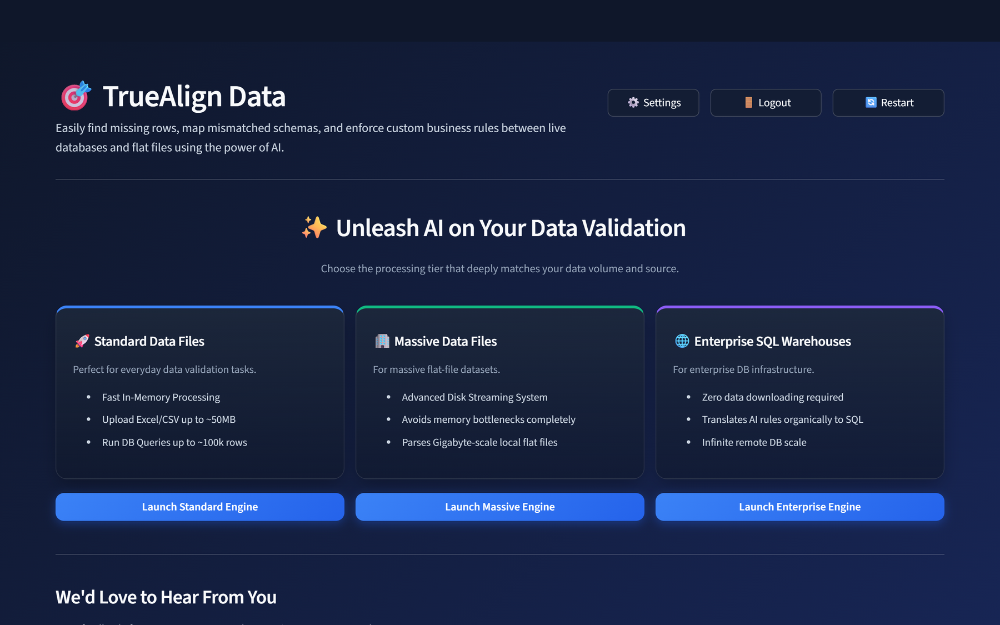
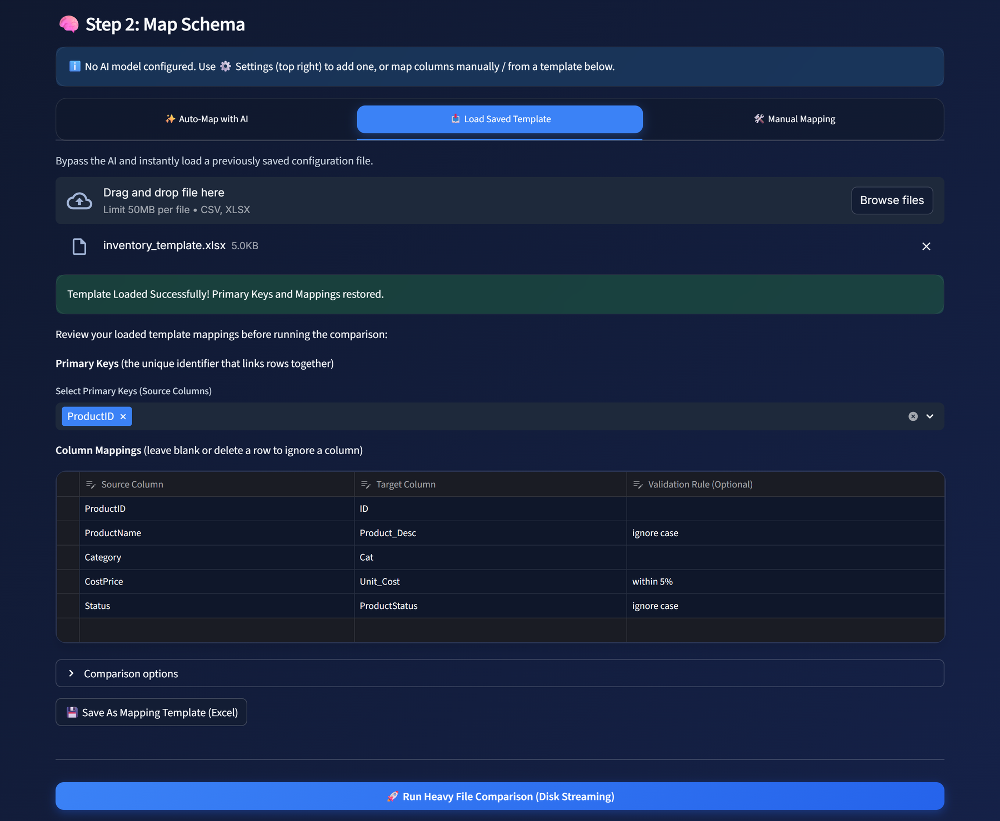
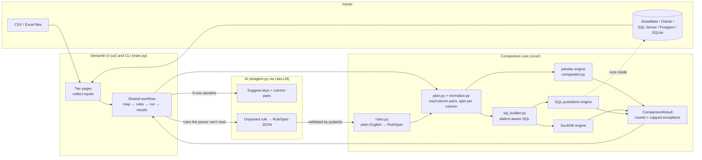

# TrueAlign Data

[](https://github.com/nvsrinath-droid/data-validator-app/actions/workflows/tests.yml)

**Source-to-target data reconciliation for ERP migrations and integrations: AI-assisted mapping, with deterministic, auditable comparison.**

TrueAlign compares a *system of record* (source) against a *target* (a migrated table, an integration feed, a vendor file) and reports exactly what does not reconcile:

- rows missing on either side
- duplicate primary keys
- value mismatches, column by column, with business tolerances

Sources can be CSV/Excel files or SQL queries against Snowflake, Oracle, SQL Server, PostgreSQL or SQLite.



---

## The problem

Every ERP program (JD Edwards to Oracle Fusion, EBS to Snowflake, a nightly vendor feed) ends up asking the same question: *does the target still agree with the source?* In practice that answer usually comes from spreadsheets full of VLOOKUPs, or one-off SQL scripts that nobody trusts twice. Real data makes it harder than a simple join:

| Real-world wrinkle | Example | Naive comparison says |
|---|---|---|
| Different schemas | `AN8` vs `Supplier_Number`, `AMT` vs `Amount` | "column not found" |
| Fixed-width CHAR padding | JDE `ALPH = 'ACME CORP      '` vs `'ACME CORP'` | mismatch |
| Type drift | `100` (NUMBER) vs `'100.00'` (VARCHAR in a flat file) | mismatch |
| NULL semantics | NULL vs NULL | mismatch (`NULL = NULL` is unknown in SQL) |
| Business tolerances | rounding within 0.01; FX within 0.5% (also for negative credit memos) | mismatch |
| Duplicate keys | two target rows per invoice after a bad load | a many-to-many join multiplies rows into dozens of false mismatches |
| Volume | 50M-row GL tables | the laptop runs out of memory |

TrueAlign handles each of these the same way in every engine, and puts the computation where the data lives.

## How it works

1. **Connect** a source and a target: files, SQL queries, or two queries in the same warehouse.
2. **Map**: an LLM proposes the primary keys and column pairs from a 5-row sample of each side. You can also load a saved template or map columns by hand. You review and edit everything in a grid.
3. **Add rules** in plain English, such as `within 0.01`, `+/- 5%`, `ignore case` or `same date, ignore time`. Rules are parsed into a small validated spec. They are never run as code.
4. **Run** on the engine that fits the data size, and get counts, row-level exceptions, and an Excel/CSV audit report.





## Architecture



The key design point: **one plan, three renderers.** `build_plan()` works out once which columns are compared, what type each one is (numeric, date or string, inferred from a sample) and which rule applies. The pandas engine turns that plan into vectorized pandas code. DuckDB and SQL pushdown share a single SQL generator that renders the same plan for each database dialect. So all three engines give the same answer, and the test suite checks this by running every scenario through all three.

## The three engines, and why computation goes to the data

| Tier | Engine | Good for | Where the work happens |
|---|---|---|---|
| **Standard** | pandas (`core/comparator.py`) | Everyday files (up to about 50 MB) and query results up to about 100k rows; mixing a file with a database query | In memory, in the app process |
| **Massive files** | DuckDB (`core/engines/duckdb_engine.py`) | Very large (GB-scale) CSV/Excel extracts | DuckDB reads the files from disk with a columnar engine; pandas never holds the full data |
| **Enterprise** | SQL pushdown (`core/engines/sql_pushdown.py`) | Both datasets already live in the same warehouse | Inside the database |

**Why push down?** Downloading two 50M-row tables to compare them costs you three times over:

- network transfer
- memory on the app server
- a copy of production data sitting outside its governance boundary

The warehouse is built to join and aggregate at that scale. So the pushdown engine sends one generated SQL statement that does everything inside the database: it normalizes each side, finds duplicate keys, runs a `FULL OUTER JOIN` on NULL-safe keys, and computes a mismatch flag per column. It then brings back only:

1. **one row of aggregate counts** (matched, mismatched, missing on each side, duplicates, mismatches per column), which are always exact, and
2. **a capped sample of exceptions** (default 1,000 per category, adjustable), using `ROW_NUMBER() OVER (PARTITION BY category …)`.

Matched rows never leave the database, which is usually the other 99.9%.

Where databases disagree, the generated SQL is adjusted per dialect:

| | NULL-safe equality | Row limit |
|---|---|---|
| DuckDB, PostgreSQL, Snowflake | `IS NOT DISTINCT FROM` | `LIMIT` |
| SQLite | `IS` | `LIMIT` |
| Oracle | `DECODE(a, b, 1, 0) = 1` | `FETCH FIRST` |
| SQL Server | `a = b OR (a IS NULL AND b IS NULL)` | `TOP` |

Numeric, date and string casts also differ per database (for example `TRY_CAST` where available, and `BINARY_DOUBLE` on Oracle).

## Comparison semantics (identical in every engine)

- **NULL vs NULL is a match**, and NULL vs a value is a mismatch, including under tolerance rules.
- **Type-aware normalization.** Each column pair is classified from a sample of both sides:
  - Numbers compare numerically: `100 = 100.00 = " 100 "`.
  - ISO dates/timestamps compare as timestamps: `2024-01-15 = 2024-01-15 00:00:00`.
  - Everything else compares as text, trimmed by default (JD Edwards CHAR padding), with blanks treated as NULL (as Oracle does).

  Both string options can be switched off, and a column's type can be forced.
- **Keys are normalized the same way**, so a padded `'AB   '` joins to `'AB'`.
- **Duplicate primary keys** are found before the join, reported on their own tab, and left out of matching instead of multiplying into false mismatches.
- **Missing rows** are detected from which side of the join a row came from, so it works whether or not the key is also a mapped column.
- **Rules:**

  | Rule text | Meaning |
  |---|---|
  | `within 0.01`, `$5`, `+/- .5` | absolute tolerance: \|a − b\| ≤ t |
  | `5%`, `within 0.5 percent` | \|a − b\| ≤ \|source\| × t/100 (absolute value, so negative amounts work) |
  | `ignore case` | case-insensitive text |
  | `ignore spaces` | text with spaces removed |
  | `same date, ignore time` | calendar date only |

  A rule the parser doesn't recognise is sent to the LLM, which may only answer with one of these rule kinds as JSON. If that fails too, the column falls back to exact match **and a warning is shown**. It never silently passes.

## Setup

Requires Python 3.10+.

**macOS / Linux**

```bash
git clone https://github.com/nvsrinath-droid/data-validator-app.git
cd data-validator-app
python3 -m venv venv
source venv/bin/activate
pip install -r requirements.txt
cp .env.example .env
streamlit run app.py
```

**Windows**

```powershell
git clone https://github.com/nvsrinath-droid/data-validator-app.git
cd data-validator-app
python -m venv venv
venv\Scripts\activate
pip install -r requirements.txt
copy .env.example .env
streamlit run app.py
```

The app opens at http://localhost:8501. Copying `.env.example` is optional; it holds server-wide API keys.

- **No API key needed to try it.** Choose *Manual Mapping*, which pairs columns by name, or load a template. To use AI mapping, add a model and key under ⚙️ Settings. Keys stay in your session and are passed on each LiteLLM call; they are never written to the server environment.
- **Database drivers:** Snowflake, Oracle (thin mode, no Instant Client needed) and PostgreSQL work from `requirements.txt` alone. SQL Server also needs Microsoft *ODBC Driver 18 for SQL Server* (or 17) installed on the host. The connection form lets you pick the driver; it defaults to 18 when installed, otherwise 17. Driver 18 encrypts connections by default, so for an on-prem server with a self-signed certificate, tick *Trust server certificate*.
- **Demo data** is in `samples/`. Try the *Massive Data Files* tier with `samples/inventory_system.csv` against `samples/vendor_catalog.csv`, or the *Enterprise* tier with SQLite `samples/local_production.db` (table `employees`).

### Command line

The CLI runs the same engines as the app, which makes it usable in a pipeline or scheduler:

```bash
python main.py samples/inventory_system.csv samples/vendor_catalog.csv --config samples/inventory_config.json
python main.py big_source.csv big_target.csv --config my_config.json --engine duckdb
python main.py source.csv target.csv --model anthropic/claude-opus-5 --auto   # AI-suggested mapping
```

Reports (JSON, Excel, CSV) are written to `output/`. The exit code is `0` when everything reconciles, `1` when exceptions are found and `2` on errors.

### Tests

```bash
pytest                                                    # full suite (~20 s)
pytest tests/test_correctness.py -q                       # engine-agreement scenarios
pytest "tests/test_correctness.py::test_percentage_tolerance_with_negative_amounts"
```

Every correctness scenario runs through **all three engines** (pushdown on SQLite) and fails if any engine disagrees with the others. Edge cases covered by tests:

| Edge case | Test(s) in `tests/test_correctness.py` |
|---|---|
| NULL vs NULL is a match; NULL vs a value is a mismatch | `test_null_vs_null_is_a_match`, `test_null_vs_value_is_a_mismatch`, `test_null_vs_null_with_tolerance_rule` |
| Numbers compare numerically: `100` = `100.00` | `test_numeric_compare_100_vs_100_00` |
| CHAR padding (JD Edwards) is trimmed, including in keys | `test_strings_are_trimmed_jde_char_padding`, `test_padded_keys_still_join`, `test_trim_can_be_disabled`, `test_blank_equals_null_by_default` |
| Dates compare as timestamps; optional date-only rule | `test_dates_compare_as_timestamps`, `test_date_only_rule_ignores_time` |
| Percentage tolerance on negative amounts | `test_percentage_tolerance_with_negative_amounts` |
| Decimal tolerances (`within 0.01`) | `test_decimal_absolute_tolerance`, plus parser cases in `tests/test_rules.py` |
| Unrecognised rules warn and fall back to exact match | `test_unknown_rule_warns_and_uses_exact`, `tests/test_rules.py::test_unrecognised_rule_warns` |
| Duplicate primary keys are reported and excluded | `test_duplicate_keys_reported_and_excluded` |
| Missing rows are found whether or not the key is mapped | `test_missing_rows_when_pk_not_in_mappings`, `test_missing_rows_with_renamed_composite_key`, `test_missing_rows_with_nulls_in_value_columns` |

The other test files cover the rest:

- `tests/test_security.py`: API keys passed per call, no `exec`/`eval`, rejection of malicious LLM output, passwords with special characters, `.gitignore`.
- `tests/test_architecture.py`: pushdown returns only exceptions and caps them, the CLI, templates, and headless [AppTest](https://docs.streamlit.io/develop/api-reference/app-testing) runs of all three tiers end to end.

## Design decisions

- **Rules are data, not code.** Having the LLM write code that the server then runs (for example with `exec()`) would let anyone who controls a rule string, or the model's output, run arbitrary code on a shared server. Instead, a rule is a `RuleSpec` with six kinds and a non-negative tolerance, validated by pydantic with extra fields rejected. The deterministic parser handles the common phrasings, so most runs make no LLM call at all and give the same result every time.
- **The AI proposes, the human decides.** The LLM only sees 5-row samples, and it only suggests keys and column pairs. It can't set rule specs or run anything. Every suggestion lands in an editable grid.
- **One plan, several renderers, instead of three copies of the logic.** Separate implementations drift apart over time; NULL handling is the classic example. A single comparison plan feeds a pandas renderer and one SQL generator, and tests enforce that the engines agree.
- **Exclude duplicate keys rather than join through them.** A 2×3 duplicate creates 6 joined rows and a pile of false mismatches. Reporting duplicates separately makes the real data-quality problem visible and keeps the mismatch counts honest.
- **Blank = NULL and trimming are on by default.** That matches how Oracle treats empty strings and how JD Edwards pads CHAR columns. Both are options for sources where whitespace matters.
- **Counts are exact; detail is sampled.** At warehouse scale, the number of exceptions matters more than downloading every one. The row cap is shown in the UI, and the results say when detail has been truncated.
- **Credentials are never stored or shared.** Connection URLs are built with SQLAlchemy `URL.create()`, so passwords with `@ : / #` work, and passwords are masked in any error shown. LLM keys live only in the user's session and are passed per call, never through `os.environ`, which every user of a server shares.
- **Generated SQL is isolated from user SQL.** User queries are wrapped as subqueries, identifiers are quoted by the database's own SQLAlchemy dialect, and generated CTE names use a `ta_` prefix so they can't clash with user tables.

## Project layout

```
app.py                 Streamlit entry point (routing only)
main.py                CLI
ui/                    Streamlit views: pages per tier, shared workflow, results, settings, auth
core/
  rules.py             plain-English rules → RuleSpec
  normalize.py         type inference and normalization
  plan.py              config + real columns → comparison plan
  comparator.py        pandas engine
  engines/             sql_builder.py (dialects), duckdb_engine.py, sql_pushdown.py
  sources.py           one adapter per tier (used by the UI and CLI)
  results.py           ComparisonResult
  db.py, templates.py, reporter.py, auth.py
ai/agent.py            LiteLLM wrapper: mapping suggestions, rule interpretation
connectors/            file and SQL readers for the pandas engine
samples/               demo data and the scripts that generate it
tests/                 pytest suite
```

## Known limitations

- The SQL for Oracle, SQL Server and Snowflake follows each database's documented syntax, but the automated suite only runs pushdown end to end against SQLite. For the other three, only the row-limit syntax is unit-tested. Validate against your own warehouse before relying on it for sign-off.
- Date detection covers ISO-8601 values. Other formats (for example `01/15/2024`, or JDE Julian dates) are compared as text unless converted in the source query.
- Excel inputs on the DuckDB tier are read through pandas. Excel caps out at about 1M rows, so for anything larger export to CSV.

## Roadmap

- **Single-table data quality checks.** Freshness, null rates, column
  profiling and referential integrity, alongside the two-table
  reconciliation.
- **Snowflake Cortex integration.** Run AI column mapping and
  root-cause analysis inside Snowflake with Cortex, so the data never
  leaves its governance boundary for LLM processing. This extends the
  same principle as the pushdown engine: take the computation to the data.
- **AI root-cause summaries.** Group exceptions by pattern and explain
  them in plain language, for example "412 rows differ only in supplier
  name capitalisation" or "all missing rows share posting date
  2024-03-31".
- **ERP-aware normalization.** JD Edwards Julian dates and implied-decimal
  amounts, and non-ISO date formats.
- **Hash-based comparison mode** for very wide or very large tables.

## About

I'm Ven, an ERP and data architect. I spent 20+ years implementing Oracle
JD Edwards across manufacturing, oil & gas, mining, public sector and real
estate, and more recently I've been the solution architect on a program
consolidating several ERPs (JD Edwards, Oracle EBS, Oracle Fusion, Glovia,
SyteLine and Sage) into a single Snowflake data warehouse.

TrueAlign comes out of that work. Source-to-target validation is where
ERP migrations succeed or fail, and it's also where AI can help most
without being trusted blindly: the model proposes mappings, and a
deterministic, tested engine decides what reconciles.

[LinkedIn](<LINKEDIN_URL>)

## License

MIT. See [LICENSE](LICENSE).
